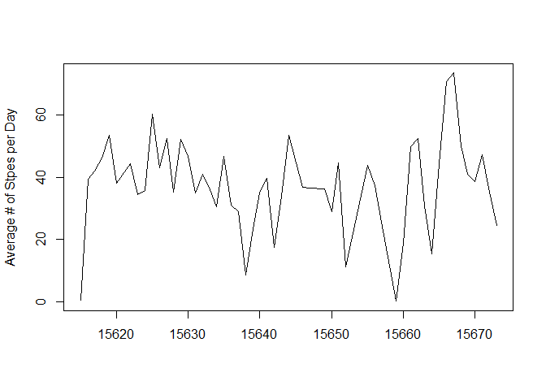
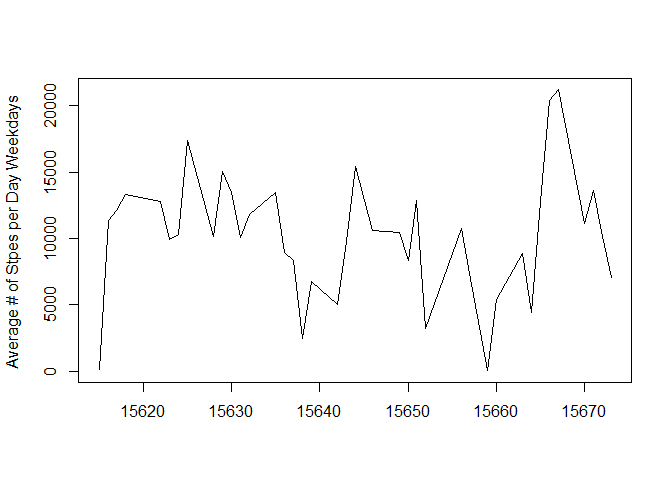
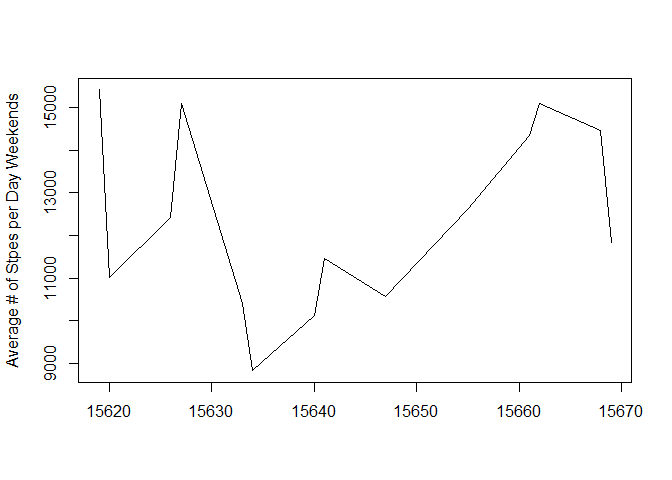

## Loading and preprocessing the data
### 1.Code for reading in the dataset and/or processing the data - start
### Download File

```r
if (!file.exists("activity.zip")){ 
  download.file("https://d396qusza40orc.cloudfront.net/repdata%2Fdata%2Factivity.zip","Factivity.zip")
}
```
### Unzip the File 

```r
if (!file.exists("activity.csv")){ 
  unzip("activity.zip")
}
```
### Load the File

```r
allData<-read.table("activity.csv",sep= ",", header=TRUE, na.strings="NA")
```
### Preview data

```r
head(allData)
```

```
##   steps       date interval
## 1    NA 2012-10-01        0
## 2    NA 2012-10-01        5
## 3    NA 2012-10-01       10
## 4    NA 2012-10-01       15
## 5    NA 2012-10-01       20
## 6    NA 2012-10-01       25
```

```r
summary(allData)
```

```
##      steps            date              interval     
##  Min.   :  0.00   Length:17568       Min.   :   0.0  
##  1st Qu.:  0.00   Class :character   1st Qu.: 588.8  
##  Median :  0.00   Mode  :character   Median :1177.5  
##  Mean   : 37.38                      Mean   :1177.5  
##  3rd Qu.: 12.00                      3rd Qu.:1766.2  
##  Max.   :806.00                      Max.   :2355.0  
##  NA's   :2304
```
### Subsetting - Removing Missing Values
##6.Code to describe and show a strategy for imputing missing data -- remove the NAs

```r
cleanData <- na.omit(allData) 
```

### Preview data

```r
head(cleanData)
```

```
##     steps       date interval
## 289     0 2012-10-02        0
## 290     0 2012-10-02        5
## 291     0 2012-10-02       10
## 292     0 2012-10-02       15
## 293     0 2012-10-02       20
## 294     0 2012-10-02       25
```

```r
summary(cleanData)
```

```
##      steps            date              interval     
##  Min.   :  0.00   Length:15264       Min.   :   0.0  
##  1st Qu.:  0.00   Class :character   1st Qu.: 588.8  
##  Median :  0.00   Mode  :character   Median :1177.5  
##  Mean   : 37.38                      Mean   :1177.5  
##  3rd Qu.: 12.00                      3rd Qu.:1766.2  
##  Max.   :806.00                      Max.   :2355.0
```

### Format Date 

```r
cleanDataFormated <-data.frame(weekdays(as.Date(cleanData$date)), cleanData$date, cleanData$steps, unlist( lapply(cleanData$date,function(x) as.Date(x,origin="1970-01-01")), use.names=FALSE), cleanData$interval)
cnames<-c("weekdays","date", "steps","formatedDate","interval")
colnames(cleanDataFormated)<-cnames
inSun<-cleanDataFormated[cleanDataFormated$weekdays=='Sunday',  ]
inSat<-cleanDataFormated[cleanDataFormated$weekdays=='Saturday',  ]
inWeekend<-rbind(inSun,inSat )
inMon<-cleanDataFormated[cleanDataFormated$weekdays=='Monday',  ]
inTue<-cleanDataFormated[cleanDataFormated$weekdays=='Tuesday',  ]
inWed<-cleanDataFormated[cleanDataFormated$weekdays=='Wednesday',  ]
inThur<-cleanDataFormated[cleanDataFormated$weekdays=='Thursday',  ]
inFriday<-cleanDataFormated[cleanDataFormated$weekdays=='Friday',  ]
inWeekday<-rbind(inMon,inTue,inWed,inThur,inFriday)
#cleanDataWithWeekens <--data.frame(cleanDataFormated$steps,cleanDataFormated$interval, inWeekend)
head(inWeekend)
```

```
##      weekdays       date steps formatedDate interval
## 1441   Sunday 2012-10-07     0        15620        0
## 1442   Sunday 2012-10-07     0        15620        5
## 1443   Sunday 2012-10-07     0        15620       10
## 1444   Sunday 2012-10-07     0        15620       15
## 1445   Sunday 2012-10-07     0        15620       20
## 1446   Sunday 2012-10-07     0        15620       25
```

### Preview data

```r
head(cleanDataFormated)
```

```
##   weekdays       date steps formatedDate interval
## 1  Tuesday 2012-10-02     0        15615        0
## 2  Tuesday 2012-10-02     0        15615        5
## 3  Tuesday 2012-10-02     0        15615       10
## 4  Tuesday 2012-10-02     0        15615       15
## 5  Tuesday 2012-10-02     0        15615       20
## 6  Tuesday 2012-10-02     0        15615       25
```

```r
summary(cleanDataFormated)
```

```
##    weekdays             date               steps         formatedDate      interval     
##  Length:15264       Length:15264       Min.   :  0.00   Min.   :15615   Min.   :   0.0  
##  Class :character   Class :character   1st Qu.:  0.00   1st Qu.:15629   1st Qu.: 588.8  
##  Mode  :character   Mode  :character   Median :  0.00   Median :15642   Median :1177.5  
##                                        Mean   : 37.38   Mean   :15644   Mean   :1177.5  
##                                        3rd Qu.: 12.00   3rd Qu.:15660   3rd Qu.:1766.2  
##                                        Max.   :806.00   Max.   :15673   Max.   :2355.0
```

### aggregated total steps per day vs per seege

```r
aggDataTotal<- aggregate(cleanDataFormated$steps, by=list(Dates=cleanDataFormated$formatedDate), FUN=sum)
aggDataTotal
```

```
##    Dates     x
## 1  15615   126
## 2  15616 11352
## 3  15617 12116
## 4  15618 13294
## 5  15619 15420
## 6  15620 11015
## 7  15622 12811
## 8  15623  9900
## 9  15624 10304
## 10 15625 17382
## 11 15626 12426
## 12 15627 15098
## 13 15628 10139
## 14 15629 15084
## 15 15630 13452
## 16 15631 10056
## 17 15632 11829
## 18 15633 10395
## 19 15634  8821
## 20 15635 13460
## 21 15636  8918
## 22 15637  8355
## 23 15638  2492
## 24 15639  6778
## 25 15640 10119
## 26 15641 11458
## 27 15642  5018
## 28 15643  9819
## 29 15644 15414
## 30 15646 10600
## 31 15647 10571
## 32 15649 10439
## 33 15650  8334
## 34 15651 12883
## 35 15652  3219
## 36 15655 12608
## 37 15656 10765
## 38 15657  7336
## 39 15659    41
## 40 15660  5441
## 41 15661 14339
## 42 15662 15110
## 43 15663  8841
## 44 15664  4472
## 45 15665 12787
## 46 15666 20427
## 47 15667 21194
## 48 15668 14478
## 49 15669 11834
## 50 15670 11162
## 51 15671 13646
## 52 15672 10183
## 53 15673  7047
```

```r
aggWeekday<- aggregate(inWeekday$steps, by=list(Dates=inWeekday$formatedDate), FUN=sum)
head(aggWeekday)
```

```
##   Dates     x
## 1 15615   126
## 2 15616 11352
## 3 15617 12116
## 4 15618 13294
## 5 15622 12811
## 6 15623  9900
```

```r
aggWeekend<- aggregate(inWeekend$steps, by=list(Dates=inWeekend$formatedDate), FUN=sum)
head(inWeekend)
```

```
##      weekdays       date steps formatedDate interval
## 1441   Sunday 2012-10-07     0        15620        0
## 1442   Sunday 2012-10-07     0        15620        5
## 1443   Sunday 2012-10-07     0        15620       10
## 1444   Sunday 2012-10-07     0        15620       15
## 1445   Sunday 2012-10-07     0        15620       20
## 1446   Sunday 2012-10-07     0        15620       25
```

### 2.Histogram of the total number of steps taken each day
### 7.Histogram of the total number of steps taken each day after missing values are imputed

```r
plot(aggDataTotal$Dates,aggDataTotal$x, type="h" , ylab="Total # of Steps per Day", xlab="", col ="black")
```

<!-- -->

### 3.Mean and median number of steps taken each day

## What is mean total number of steps taken per day?
### Answer: Average # of steps per day excluding #NA values 

```r
aggDataAverage<- aggregate(cleanDataFormated$steps, by=list(Dates=cleanDataFormated$formatedDate), FUN=mean)
aggDataAverage
```

```
##    Dates          x
## 1  15615  0.4375000
## 2  15616 39.4166667
## 3  15617 42.0694444
## 4  15618 46.1597222
## 5  15619 53.5416667
## 6  15620 38.2465278
## 7  15622 44.4826389
## 8  15623 34.3750000
## 9  15624 35.7777778
## 10 15625 60.3541667
## 11 15626 43.1458333
## 12 15627 52.4236111
## 13 15628 35.2048611
## 14 15629 52.3750000
## 15 15630 46.7083333
## 16 15631 34.9166667
## 17 15632 41.0729167
## 18 15633 36.0937500
## 19 15634 30.6284722
## 20 15635 46.7361111
## 21 15636 30.9652778
## 22 15637 29.0104167
## 23 15638  8.6527778
## 24 15639 23.5347222
## 25 15640 35.1354167
## 26 15641 39.7847222
## 27 15642 17.4236111
## 28 15643 34.0937500
## 29 15644 53.5208333
## 30 15646 36.8055556
## 31 15647 36.7048611
## 32 15649 36.2465278
## 33 15650 28.9375000
## 34 15651 44.7326389
## 35 15652 11.1770833
## 36 15655 43.7777778
## 37 15656 37.3784722
## 38 15657 25.4722222
## 39 15659  0.1423611
## 40 15660 18.8923611
## 41 15661 49.7881944
## 42 15662 52.4652778
## 43 15663 30.6979167
## 44 15664 15.5277778
## 45 15665 44.3993056
## 46 15666 70.9270833
## 47 15667 73.5902778
## 48 15668 50.2708333
## 49 15669 41.0902778
## 50 15670 38.7569444
## 51 15671 47.3819444
## 52 15672 35.3576389
## 53 15673 24.4687500
```
### Median # of steps  

```r
aggDataMedian<- aggregate(cleanDataFormated$steps, by=list(Dates=cleanDataFormated$formatedDate ), FUN=median )
aggDataMedian
```

```
##    Dates x
## 1  15615 0
## 2  15616 0
## 3  15617 0
## 4  15618 0
## 5  15619 0
## 6  15620 0
## 7  15622 0
## 8  15623 0
## 9  15624 0
## 10 15625 0
## 11 15626 0
## 12 15627 0
## 13 15628 0
## 14 15629 0
## 15 15630 0
## 16 15631 0
## 17 15632 0
## 18 15633 0
## 19 15634 0
## 20 15635 0
## 21 15636 0
## 22 15637 0
## 23 15638 0
## 24 15639 0
## 25 15640 0
## 26 15641 0
## 27 15642 0
## 28 15643 0
## 29 15644 0
## 30 15646 0
## 31 15647 0
## 32 15649 0
## 33 15650 0
## 34 15651 0
## 35 15652 0
## 36 15655 0
## 37 15656 0
## 38 15657 0
## 39 15659 0
## 40 15660 0
## 41 15661 0
## 42 15662 0
## 43 15663 0
## 44 15664 0
## 45 15665 0
## 46 15666 0
## 47 15667 0
## 48 15668 0
## 49 15669 0
## 50 15670 0
## 51 15671 0
## 52 15672 0
## 53 15673 0
```

###  4.Time series plot of the average number of steps taken -lok 

```r
##png(file="Average # of Stpes per Day.png",width=480,height=480)
plot(aggDataAverage$Dates,aggDataAverage$x, type="l", ylab="Average # of Stpes per Day", xlab="", col ="black")
```

<!-- -->

```r
#dev.off()
```
### 5.The 5-minute interval that, on average, contains the maximum number of steps

### aggregate # of steps by interval and date
### get the max of that 


```r
aggDataTotalperInterval<- aggregate(cleanDataFormated$steps, by=list(Intervals=cleanDataFormated$interval), FUN=sum)
head(aggDataTotalperInterval)
```

```
##   Intervals   x
## 1         0  91
## 2         5  18
## 3        10   7
## 4        15   8
## 5        20   4
## 6        25 111
```

```r
MaxIntervalValue<- max(aggDataTotalperInterval)
head(MaxIntervalValue) 
```

```
## [1] 10927
```

```r
filterTable<-data.frame(aggDataTotalperInterval)
MaxINtervalLabel<-filterTable[filterTable$x==MaxIntervalValue,1]
MaxINtervalLabel
```

```
## [1] 835
```

So `MaxINtervalLabel` is the interval with maximum number of steps 


### 8. Panel plot comparing the average number of steps taken per 5-minute interval across weekdays and weekends

```r
plot(aggWeekday$Dates,aggWeekday$x, type="l" ,ylab="Average # of Stpes per Day Weekdays ", xlab="", col ="black")
```

<!-- -->

```r
plot(aggWeekend$Dates,aggWeekend$x, type="l",ylab="Average # of Stpes per Day Weekends", xlab="", col ="black")
```

<!-- -->

## Are there differences in activity patterns between weekdays and weekends?

Yes 


